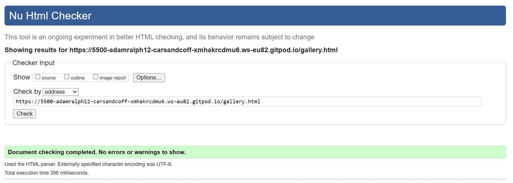
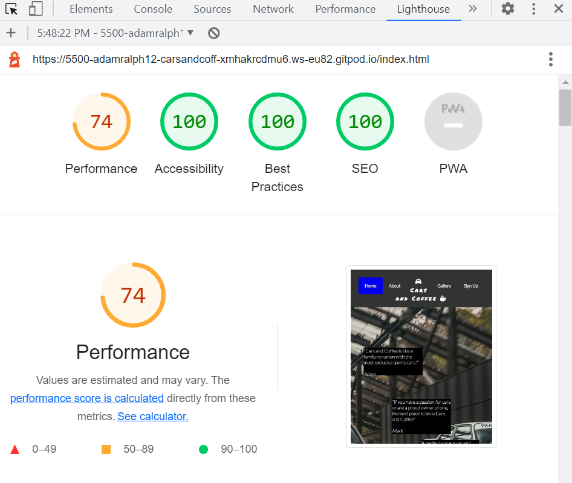
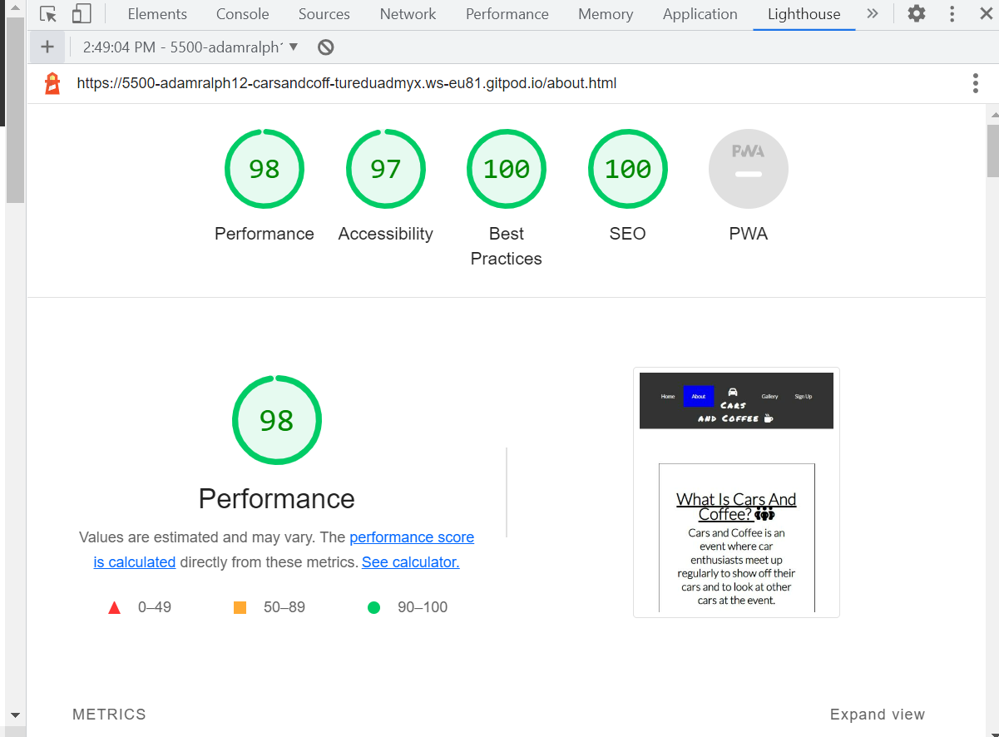

# Portfolio project - 1 HTML/CSS Essentials

# Cars and Coffee
#### A website for a Dublin based car event.
[Cars and Coffee website here]()

 Cars and Coffee is a webite for people who have a passion for cars, it is an event website that has information of what Cars and Coffee is, information about when the event is happening and locations. 

Users of this website will be able to navigate exactly what they are looking for through the navigation bar in the header of the page.

# Table of contents
1. [Features](#features)
    * [Navigation bar](#nav-bar)
    * [Home page](#home-page)
    * [About page](#about-page)
    * [Gallery page](#gallery-page)
    * [Signup page](#signup-page)
    * [Footer](#footer)
2. [User stories](#user-stories)
3. [Technology used](#technology-used)
4. [Testing](#testing)
    * [CSS](#css)
    * [HTML](#html)
    * [Lighthouse](#lighthouse)
5. [Bugs](#bugs)
7. [Deployment](#deployemnt)
8. [Credits](#credits)
9. [Acknowledgement](#acknowledgement)

# Features

# Navigation bar

* The navigation is featured at the top of the page with the name of the website too.
* It includes a home page, about, gallery and a sign up page.
* The navigation bar has two icons either side of the name of the website which I got from Font Awesome.
* I chose a grey background colour for the header and a white colour for the text, I also chose a blue background colour to indicate which page the user is on.

## Home page

* The home page has a background image of two cars. There is 3 boxes on the image which are quotes that people have said from being at a Cars and Coffee event, I decided to put these boxes on the image so the user will see it clearly.

# About page

* The about page has three h3 elements with three questions with icons and three answers that users will find the information they need, there is also a map location on the last question which brings the user to the location when clicked on the link.
* There is also a picture of 3 cars underneath the questions and answers.

# Gallery page

* The gallery page has images of previous Cars and Coffee events, this shows the user what an event will look like and what to expect, it might excite the user to go to an event.
* The photos are displayed in a column count of 2 and reduce to a column count of 1 if looked at on a tablet/phone.

# Sign up page 

* The sign up page has a background image and has a sign up form for the user to stay informed of the next Cars and Coffee event.
* The sign up form has a black clear background using box shadow so that you can still see the background image, it has a first name, last name and email address input and also has submit button, I chose a blue colour for the submit button so it is clear for the user to find.
* If the user presses submit without filling out the entire form it will ask the user to please fill out ths field.

# Footer

* I used the footer from the Love Running practive project, it consists of a Facebook, Twitter, YouTube and Instgram which will bring the user to these websites when clicked on the icon.
* I chose a blue colour for the social media icons to keep it consistent with the rest of the website.

# User stories
* I to be able to access the website without any issues.
* I to gain information from the website.
* I want to be able to leave my information in a signup form.

# Technology used
* HTML
* CSS

# Testing
## CSS
 ### The website has no issues on W3C css

## HTML
### W3C HTML validator for Home page

### W3C HTML validator for About page

### W3C HTML validator for Gallery page

### W3C HTML validator for Sign up page

## Lighthouse
### Home page lighthouse for mobile

### About page lighthouse for mobile

### Gallery page lighthouse for mobile

### Sign Up page lighthouse for mobile

# Bugs
* I encountered 2 bugs with my media queries for mobile as it was not responsive, I fixed this by researching how to correctly implement media queries so it is resposive across all devices.
* I had issues with my gallery images as they were stretched and pixilated, I fixed this by adding 'object-fit: contain; to my images which fixed this.

# Deployment

Deployment
This section should describe the process you went through to deploy the project to a hosting platform (e.g. GitHub)

The site was deployed to GitHub pages. The steps to deploy are as follows:
* In the GitHub repository, navigate to the Settings tab
From the source section drop-down menu, select the Master Branch.
* Once the master branch has been selected, the page will be automatically refreshed with a detailed ribbon display to indicate the successful deployment.

# Credits

# Home page image
### Link
 * https://www.topgear.com/car-news/retro/which-better-bmw-e30-m3-or-mercedes-190e

# Image and location link on about page
### Link
* https://newsroom.porsche.com/en_AU/2020/products/911-turbo-s-launch-control-the-event-22731.html

### Link
* https://www.castleknockhotel.com/

# Icons
### Link
 * https://fontawesome.com/

# Gallery images
'Cars on a runway'
### Link
* https://wallpaper.dog/sports-car-wallpapers

 'A birds eye view of cars and coffee'
### Link
 * https://www.posthtx.com/event/coffee-and-cars-at-post

'Cars and coffee event'
### Link
 * https://canepa.com/category/news/canepa-cars-and-coffee/

'Mercedes cars'
### Link
 * https://www.pexels.com/photo/white-mercedes-benz-cars-120049/

'Top view of cars and coffee'
### Link
 * https://www.pexels.com/photo/high-angle-photo-of-vehicles-parked-near-building-753876/

'Blue ford car'
### Link
 * https://www.pexels.com/photo/parked-cars-1077785/

# Sign up image
### Link
* https://wallhere.com/en/wallpaper/1759671

# Footer
The footer social media icons and links our from the 'Love Running' project.

 # Acknowledgement
 I would like to thank;
 
 * My mentor [Jubril Akolade](https://www.linkedin.com/in/jubrillionaire/) who is always there for support and to answer any questions i have for him.
 * The slack community (https://slack.com/intl/en-ie/https://slack.com/intl/en-ie/) which i can always rely on.
 * I would like to thank the assessment team for taking their time to look over my project.
